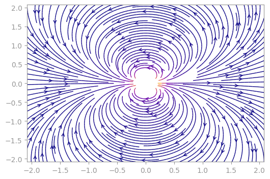

<p align="center">
  <a href="https://github.com/sillynacht/PolyaCplot"></a>
</p>

Install with

```
pip install PolyaCplot
```

and use as 

```python
import sympy as np
import matplotlib.pyplot as plt
import PolyaCplot as pc


fig, ax = plt.subplot()

z = sp.symbols('z')
f = 1 / z ** 2

pc.streamplot(f, z, ax)

plt.show()
```

<p align="center">
  
</p>
